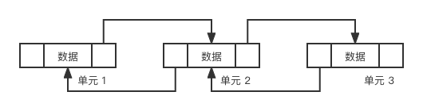
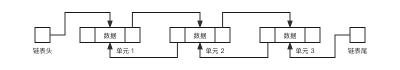
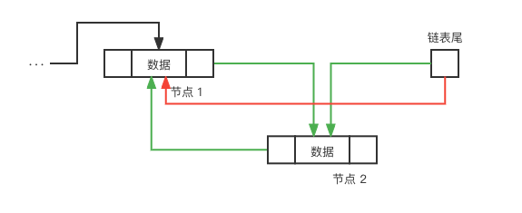
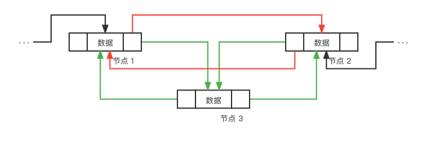

# 链表

!!! note "Copyright"
    本页面贡献者：[DodoZhang](github.com/DodoZhang)。
    本页面内容遵循 MIT 协议，转载请附上原文出处链接和本声明。

## 简介

**链表**（Linked List）是一种通过**指针**将数据相互连接的**列表**。链表在操作前需要先检索，然后可以高效的随机插入、删除，但是由于多出了检索这一步骤，它在随机查询上效率不如数组表；额外的，链表还支持分割、合并操作。  
链表可以分为单向链表和双向链表，单向链表只能单向顺序检索，而双向链表可以双向顺序检索。在本文中我们所讲的链表特指**双向链表**；  
相比起数组表，单向链表每一个元素需要多消耗一个`size_t`的内存空间，双向链表则需要多消耗两个`size_t`的空间；   
在 STL 中，`std::list`就是链表。

## 性能

对于一个长度为`n`的链表：

|操作|时间复杂度|
|:--:|:--:|
|检索第m位元素|$O(\min\{m, n - m\}$)|
|检索下一位元素|$O(1)$|
|查询被检索的元素|$O(1)$|
|顺序查询|$O(1)$|
|向后追加|$O(1)$|
|在被检索的元素后插入|$O(1)$|
|删除末项|$O(1)$|
|删除被检索的元素|$O(1)$|

## 节点，节点链和链表

链表中每一个**元素**都被储存在**节点**（Node）中，指针的结构如下图：  

  

节点包含三个部分：**前指针**，**后指针**和**数据**，数据指这个节点保存的元素，前指针和后指针分别指向这个节点前后的节点；通过前后指针，我们可以将若干个节点串联起来，从而形成一串节点链：  

  

为了方便查找和追加，我们可以将节点链的一个节点和最后一个节点用**头指针**和**尾指针**记录下来，这就构成了一个双向链表：  



## 结构和成员变量

```cpp
class LinkedList
{
public:
    struct Node
    {
        Node *prev, *next;
        int content;
    };

     Node *first, *last;
     int len;
}
```

其中`prev`，`next`是节点的前、后指针；  
`content`是节点的数据内容；  
`first`，`last`是链表的头、尾指针；  
`len`是链表的长度。

## 方法
#### 构造函数

```cpp
LinkedList()
{
    first = last = nullptr;
    len = 0;
}
```

#### 析构函数

析构链表时需要依次析构链表的每一个节点。

```cpp
~LinkedList()
{
    Node *node = first;
    while (node)
    {
        node = node->next;
        //注意此时node已经是下一个节点的地址了，我们需要删除node->prev而不是node
        delete node->prev;
    }
}
```

!!! Warning "Warning"
    我们需要先将`node`移动到下一个节点，再进行`delete`操作；  
    如果先进行`delete`操作会导致`node->next`被删除，从而无法访问到下一个节点。


#### 检索节点

```cpp
Node *at(int index)
{
    //如果索引小于数组长度的一半，就从前向后检索，反之就从后向前检索
    if (index <= len / 2)
    {
        Node *node = first;
        for (int i = 0; i < index; i ++) node = node->next;
        return node;
    }
    else
    {
        Node *node = last;
        for (int i = len - 1; i > index; i --) node = node->prev;
        return node;
    }
}
```

#### 获取节点索引

```cpp
int indexOf(Node *node)
{
    Node *iter = first;
    for (int i = 0; iter != last; i ++)
    {
        if (iter == node) return i;
        iter = iter->next;
    }
    return len - 1;
}
```

#### 获取节点对应元素的值

```cpp
int set(Node *node)
{
    return node->value;
}
```

#### 设置节点对应元素的值

```cpp
void set(Node *node, int value)
{
    node->value = value;
}
```

#### 获取长度

```cpp
int length()
{
    return len;
}
```

#### 向后追加元素

  

如图所示，假设节点1是原来的表尾节点，现在要在其后面追加节点2。  
那么我们需要将表尾指针指向的对象从节点1改为节点2，并将节点1和节点2相互连接；  
即去除<font color="red">红线</font>对应的的指针连接，添加<font color="green">绿线</font>对应的的指针连接。

!!! Warning "Warning"
    注意表为空的情况，此时节点1不存在。

```cpp
void appendLast(int value)
{
    if (last)
    {
        Node *node = new Node {last, nullptr, value};
        last->next = node;
        last = node;
    }
    else
    {
        first = last = new Node {nullptr, nullptr, value};
    }
    len ++;
}
```

#### 删除末端元素

即执行一次向后追加的反操作，断开节点1和节点2的连接后，将表尾指针指向的对象从节点2改回节点1。

```cpp
void removeLast()
{
    if (len != 1)
    {
        Node *node = last->prev;
        node->next = nullptr;
        delete last;
        last = node;
    }
    else
    {
        delete last;
        first = last = nullptr;
    }
    len --;
}
```

#### 向前追加元素

同理的，我们可以写出向前追加的情况。

```cpp
void appendFirst(int value)
{
    if (first)
    {
        Node *node = new Node {nullptr, first, value};
        first->next = node;
        first = node;
    }
    else
    {
        first = last = new Node {nullptr, nullptr, value};
    }
    len ++;
}
```

#### 删除首位元素

```cpp
void removeFirst()
{
    if (len != 1)
    {
        Node *node = first->next;
        node->prev = nullptr;
        delete first;
        first = node;
    }
    else
    {
        delete first;
        first = last = nullptr;
    }
    len --;
}
```

#### 在节点后插入元素

  

如图所示，如果我们想要在节点1后插入节点3，  
那么我们需要断开节点1和节点2之间的连接，并将节点1、3和节点3、2分别相互连接；  
即去除<font color="red">红线</font>对应的的指针连接，添加<font color="green">绿线</font>对应的的指针连接。

!!! Warning "Warning"
    如果节点是尾节点，节点2不存在，问题需要退化为向后追加元素的问题。

```cpp
void insertAfter(Node *node, int value)
{
    if (node == last)
    {
        appendLast(value);
        return;
    }
    //把节点2的前指针指向节点3
    node->next->prev = new Node {node, node->next, value};
    //把节点1的后指针指向节点3
    node->next = node->next->prev;
    len ++;
}
```

#### 在节点前插入元素

```cpp
void insertAfter(Node *node, int value)
{
    if (node == first)
    {
        appendFirst(value);
        return;
    }
    //把节点1的后指针指向节点3
    node->prev->next = new Node {node->prev, node, value};
    //把节点2的前指针指向节点3
    node->prev = node->prev->next;
    len ++;
}
```

#### 移除节点

和插入过程相反，如果我们想要移除在节点1和节点2之间的节点3，  
那么我们需要断开节点1、3和节点3、2分别相互连接，并将节点1、2相互连接；  
我们还是需要注意节点3是否是头尾节点，如果是，则需要将问题退化为删除首末位元素的问题。  
我们在使用这个方法时需要注意节点移除后`node`指针会**无效化**。

```cpp
void remove(Node *node)
{
    if (node == last)
    {
        removeFirst(value);
        return;
    }
    if (node == first)
    {
        removeLast(value);
        return;
    }
    //把节点1的后指针指向节点2
    node->prev->next = node->next;
    //把节点2的前指针指向节点1
    node->next->prev = node->prev;
    delete node;
}
```

#### 分割链表

分割函数可以将一个链表在特定位置切断为两个链表。  
此处我们实现的是将链表在`pos`节点前切断，链表的前半段将保留在原链表中，后半段将以返回值的形式输出。

```cpp
LinkedList split(Node *pos)
{
    //如果切割位点在首位前，将原链表浅层复制给新链表
    if (pos == first)
    {
        LinkedList newList = new LinkedList(*this);
        first = last = nullptr;
        len = 0;
        return newList;
    }
    int index = indexOf(pos);
    LinkedList newList = new LinkedList();
    newList.first = pos;
    newList.last = last;
    newList.len = len - index;
    last = pos.prev;
    len = index;
    return newList;
}
```

#### 合并链表

合并函数可以将两个链表拼接为一个链表。  
此处我们实现的是将链表`list`拼接到原链表后。  
在使用这个函数后需要注意`list`已经**无效化**，不应该再被使用。

```cpp
void combine(const LinkedList &list)
{
    //如果list数组为空，则不需要操作
    if (!list.len) return;
    //如果原数组为空，则浅层复制list数组
    if (!len)
    {
        first = list.first;
        last = list.last;
        len = list.len;
        return;
    }
    last->next = list.first;
    list.first->prev = last;
    last = list.last;
    len += list.len;
}
```