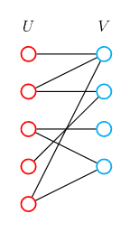
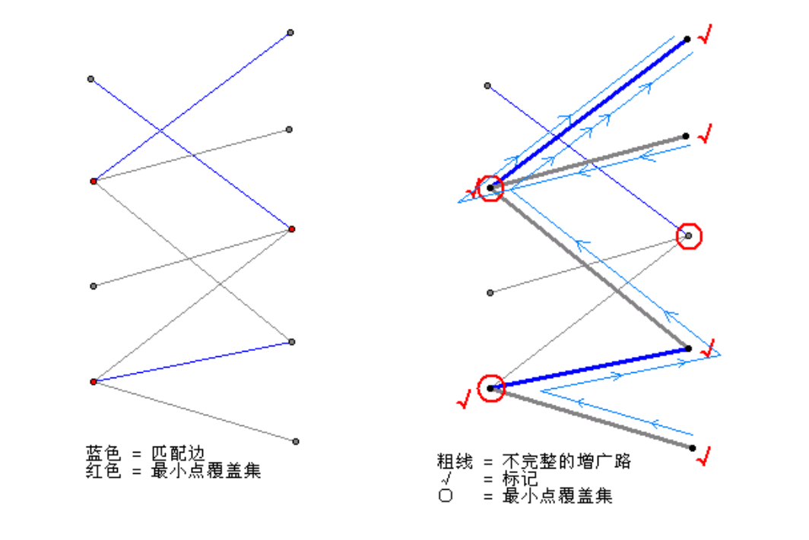

!!! note "Copyright"
    本页面贡献者：[DcmTruman](https://github.com/DcmTruman)，[zrz](https://github.com/BehindShadow)。
    本页面内容遵循 MIT 协议，转载请附上原文出处链接和本声明。

## 二分匹配


### 二分图


二分图：又称二部图。简单来说，如果图中点可以被分为两组，并且使得所有边都跨越组的边界，则这就是一个二分图。准确地说：把一个图的顶点划分为两个不相交集 U 和 V ，使得每一条边都分别连接U、V中的顶点。如果存在这样的划分，则此图为一个二分图。U、V可分别乘左部和右部。

二分图的一个等价定义是：不含有「含奇数条边的环」的图。



### 例题

有$n$个人，其中有$m$对关系$(x,y)$表示x和y互相仇恨，$x$和$y$不能出现在同一个场合。问，能不能将这$n$个人，分成两组且每组之间任意两个人都不仇恨？


染色法判定：

- 尝试用黑白两种颜色标记图上的节点，当一个节点被标记后，他的所有相邻的节点应该被标记为与它相反的颜色。如果标记过程中产生了冲突，说明图中存在奇环。

- dfs遍历，复杂度 $O(n+m)$


```c++
bool dfs(int now,int col)
{
    color[now] = col;
    for(int i = head[now];~i;i = edge[i].next){
        int to = edge[i].to;
        if(color[now] == color[to])return false;
        if(!color[to]){
            if(!dfs(to,3-col))return false;
        }
    }
    return true;
}
```


### 匹配

- 匹配：在图论中，一个「匹配」（matching）是一个**边的集合**，其中任意两条边都没有公共顶点。可以将图中边分为匹配边、非匹配边。点分为匹配点，非匹配点

- 最大匹配：一个图所有匹配中，所含匹配边数最多的匹配，称为这个图的最大匹配。

- 完美匹配：给定一张二分图，其左右节点数相同，均为$N$个节点。如果醉打匹配包含$N$条边，则称该二分图包含完美匹配。

- 交替路：交错路，从一个未匹配点出发，依次经过非匹配边、匹配边、非匹配边…形成的路径叫交替路。

- 增广路：从一个未匹配点出发，走交替路，如果途径另一个未匹配点（出发的点不算），则这条交替路称为增广路（agumenting path）。


思考：

有n个人，若干男生，若干女生，其中男女之间有m对关系(x,y)，表示x、y之间有好感，问你最多能挑多少对人，使得每一对都是有好感的（每个人只能被挑一次）

#### how?

- 匈牙利算法：$O(nm)$

- 二分图最大匹配可以转换成网络流模型。

说明：

将源点连上左边所有点，右边所有点连上汇点，容量皆为1。原来的每条边从左往右连边，容量也皆为1，最大流即最大匹配。

使用 Dinic 算法 求该网络的最大流，复杂度$O(\sqrt{n}m)$

#### 匈牙利算法概念

回顾两个概念：

- 交替路：从一个未匹配点出发，依次经过非匹配边、匹配边、非匹配边…形成的路径叫交替路。

- 增广路：从一个未匹配点出发，走交替路，如果途径另一个未匹配点（出发的点不算），则这条交替路称为增广路（agumenting path）。

性质：

增广路有一个重要特点：非匹配边比匹配边多一条。因此，研究增广路的意义是改进匹配。只要把增广路中的匹配边和非匹配边的身份交换即可。由于中间的匹配节点不存在其他相连的匹配边，所以这样做不会破坏匹配的性质。交换后，图中的匹配边数目比原来多了 1 条。

有如下定理：

二分图中的一组匹配S是最大匹配，当且仅当图中不存在S增广路


#### 匈牙利算法

- 设$S = \varnothing$ ，即所有边都是非匹配边
- 寻找增广路**path**，把路径上的所有边的匹配状态取反，得到一个更大的匹配$S'$。
- 重复第2步，直至图中不存在增广路。

关键在于如何找到增广路。匈牙利算法依次尝试给每一个**左部节点$x$寻找一个匹配的右部节点$y$**。右部点$y$能于左部点$x$，匹配需要满足如下两个条件：

- $y$本身就是非匹配点，此时$(x,y)$就是非匹配边，自己构成长度为$ 1 $的增广路。
- $y$已经和左部一节点$x'$匹配，但是**从$x'$出发能找到另一个右部点$y'$与之匹配。** 

本质桑使用的还是dfs递归的从$x$出发寻找增广路，回溯时将路径上的匹配标记取反。

```cpp
int vis[maxn];
vector<int>g[maxn];
int match[maxn];
bool dfs(int x){
    for(int i =0;i<g[x].size();i++){
        int v = g[x][i];
        if(!vis[v]){
            vis[v] = 1;
            if(!match[v]||dfs(match[v])){
                match[v] = x;
                return true;
            }
        }
    }
    return false ;
}
```

```cpp
//主函数内
int ans = 0;
memset(match,0,sizeof match);
for(int i = 1;i <= n;i++){
    memset(vis,0,sizeof(vis));
    if(dfs(i)){
        ans++;
    }
}
```

### 进阶

感兴趣自己可以了解一下：

-  多重匹配
-  带权匹配
-  最优匹配（KM算法）

### 覆盖和独立集

概念：

- 最小边覆盖：最少的边覆盖所有点
- 最小点覆盖：最少的点覆盖所有边


性质：

- ==二分图== 的最大匹配 = 最小点覆盖  --《Konig定理》
- ==对于不存在孤点的任意图==，最大匹配+最小边覆盖=顶点数



概念：

- 最大团&最大独立集：最大的点集，任意两点之间都有边/都没边

性质：

- 无向图$G$，的最大团等于其补图$G'$的最大独立集

- ==任意图== 中，最大独立集+最小点覆盖=顶点数
- ==二分图== 中，最大独立集 = 顶点数 - 最大匹配数
- ==二分图== 中，最大独立集 = 最小边覆盖


### 图论的精髓 ： 建图

因为疫情，大家都不想在电影院离得太近，每个人x曼哈顿距离内都不想有其他人，问怎么安排使得做的人做多？


??? note "例题1"
    
    [行列建边](http://poj.org/problem?id=3041)

??? note "例题2"
    给你个棋盘，棋盘上某些位置有棋子，每行每列最多只能选一个棋子，让你选尽可能多的棋子

    [awing](https://www.acwing.com/problem/content/375/)

??? note "例题3"

    [The 2021 ICPC Asia Shenyang Regional ContestEditorial](https://codeforces.com/gym/103427/problem/B)

??? note "例题4"

    给一个数k，问他的正整数倍数中，（十进制下）每一位的和最小是多少,$2\leq k \leq 10^{5}$

    - 从1开始 ， 建立一个数x到x+1和x*10分别为1和0的边，最后找到最快到达的k的倍数，即答案最短路


