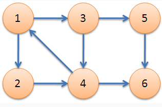
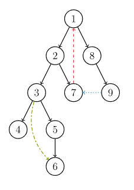

!!! note "Copyright"
    本页面贡献者：[zrz](https://github.com/BehindShadow)。
    本页面内容遵循 MIT 协议，转载请附上原文出处链接和本声明。

## 强连通

在有向图G中，如果两点互相可达，则称这两个点强连通，如果G中任意两点互相可达，则称G是强连通图。

### 简单性质
- 一个有向图是强连通的，当且仅当G中有一个回路（环），它至少包含每个节点一次。
- 非强连通有向图的极大强连通子图，称为强连通分量（SCC即Strongly Connected Componenet）。



1，2，3，4是一个强连通分量，5和6是另两个强连通分量


## Tarjan 算法

### Tarjan简介
Robert E. Tarjan（罗伯特·塔扬，1948~），生于美国加州波莫纳，计算机科学家。

Tarjan 发明了很多算法结构。不少他发明的算法都以他的名字命名，以至于有时会让人混淆几种不同的算法。比如求各种连通分量的 Tarjan 算法，求 LCA（Lowest Common Ancestor，最近公共祖先）的 Tarjan 算法。并查集、Splay、Toptree 也是 Tarjan 发明的。

我们这里要介绍的是在有向图中求强连通分量的 Tarjan 算法。

### DFS 生成树

在介绍该算法之前，先来了解 DFS 生成树，我们以下面的有向图为例：



有向图的 DFS 生成树主要有 4 种边（不一定全部出现）：

1. 树边（tree edge）：示意图中以黑色边表示，每次搜索找到一个还没有访问过的结点的时候就形成了一条树边。
2. 回边（back edge）：示意图中以红色边表示（即 **7 -> 1**），指向祖先结点的边。
3. 横叉边（cross edge）：示意图中以蓝色边表示（即 **9 -> 7**），它主要是在搜索的时候遇到了一个已经访问过的结点，但是这个结点 并不是 当前结点的祖先。
4. 前向边（forward edge）：示意图中以绿色边表示（即 **3 -> 6**），它是在搜索的时候遇到子树中的结点的时候形成的。

我们考虑 DFS 生成树与强连通分量之间的关系。

**有如下结论:**

如果结点  是某个强连通分量在搜索树中遇到的第一个结点，那么这个强连通分量的其余结点肯定是在搜索树中以  为根的子树中。结点  被称为这个强连通分量的根。


### Tarjan

Tarjan的本质就是在dfs时维护一些变量，并根据变量的值进行操作

维护如下变量:

- **dfn[u]**：dfs时达到顶点u的次序号（时间戳）dfs序
- **low[u]**：从$u$出发的dfs树中 最小的次序号,追溯值
- 开始时对任意顶点$u$，先将顶点$u$入栈，给其加上时间戳$dfn[u]=low[u]=++num$
- 扫描$u$能到达的顶点$v$，如果v没有被访问过，则$dfs(v)$外加 $low[u]=min(low[u],low[v])$，如果v在栈$low[u]=min(low[u],dfn[v])$，
- 扫描完$v$以后，如果$dfn[u]=low[u]$，则将从栈顶到u之间的点出栈，可以发现这些点的low值一样，且只有“源头”处的$low = dfn$


???+note "代码"
    时间复杂度:$O(n*m)$

    ```cpp
    //声明变量
    #define ms(a,v)  memset(a,v,sizeof(a))
    int n,m;
    const int maxn = 10005; //点数
    int head[maxn],cnt = 0;
    struct {
        int u,v,next;
    }e[100005];
    void add(int u,int v){
        e[cnt].u = u;
        e[cnt].v = v;
        e[cnt].next = head[u];
        head[u] = cnt++;
    }
    int low[maxn],dfn[maxn],vis[maxn];//vis数组是记录点是否在栈内  dfn是记录每个点dfs序
    stack<int> s;
    int num = 0;//dfs序计数，或者理解为时间戳 
    int lis_num = 0;//强连通分量的个数 
    int tag[maxn];//tag是记录每个点的属于几号连通分量
    ```

    ```c++
    //初始化代码
    void inits(){
        lis_num = 0;num = 0;cnt = 0;
        ms(head,-1);
        ms(vis,0);
        ms(tag,0);
        ms(dfn,0);
        ms(low,0);
    }
    ```
    Tarjan
    ```c++
    void Tarjan(int now){
        s.push(now);//栈可以数组代替
        vis[now] = 1;
        dfn[now] = low[now]= ++num;
        for(int i=head[now];~i;i=e[i].next){
            int v = e[i].v;
            if(!dfn[v]){
                Tarjan(v);
                low[now]  = min(low[now],low[v]);
            }
            else if(vis[v]){
                low[now] = min(low[now],dfn[v]);
            }
        }
        if(dfn[now]==low[now]){//出栈
            lis_num++;
            int t;
            do{
                t = s.top();
                vis[t] = 0;
                tag[t] = lis_num;//这个可以没有如果不需要记录联通分量的序号
                s.pop();	
            }while(t!=now);
        }
    }
    ```
### 缩点

**思考：**

- 对一张图用tarjan算法处理过后，可以把有向有环图中每个强连通分量（其中的每两个点都互相可达）看作是一个新的点，最终建立起一张新的有向无环图（DAG）。
- 有向无环图必定不是强连通的，（由强连通的定理可证）。

???+note "代码"
    可用于DAG的缩点（有别于并查集的缩点）
    例如：
    ```c++
    for(int i=1; i<=n; i++)
    {
        int sz=g[i].size();
        for(int j=0; j<sz; j++)
        {
            int v=g[i][j];
            if(color[v]!=color[i])
            {
                du[color[i]]++;
                //在这里可以建一个新的图
            }
        }
        cnt[color[i]]++;//统计每一个分量的点数
    }
    ```

## 参考资料
- [图论 OI Wiki](https://oi-wiki.org/graph/mst/)