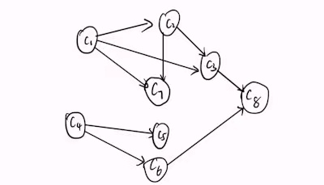
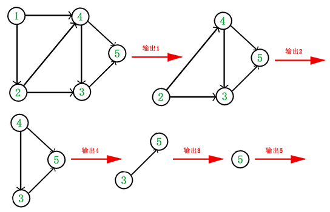
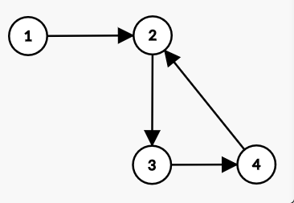
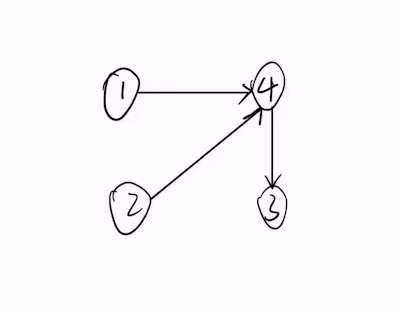

!!! note "Copyright"
    本页面贡献者：[zrz](https://github.com/BehindShadow)。
    本页面内容遵循 MIT 协议，转载请附上原文出处链接和本声明。


前置知识：图论基本概念
## 有向无环图

- 边有向，无环。

- 英文名叫 Directed Acyclic Graph，缩写是 DAG。

### 简单性质

- 能**拓扑排序**的图，一定是有向无环图；

- 有向无环图，一定能拓扑排序；

- (归纳法)假设节点数不超过$k$的 有向无环图都能拓扑排序，那么对于节点数等于$k$的，考虑执行拓扑排序第一步之后的情形即可。

## 拓扑排序

### 简要介绍：

**思考：加入我们拿到如下关系的表，我们要如何排课呢？**


课程代号|课程名称|先修课
---|---|---
C1|程序设计基础|无
C2|离散数学|C1
C3|数据结构|C1,C2
C4|高等数学|无
C5|线性代数|C4
C6|普通物理学|C4
C7|编译原理|C1,C2
C8|计算机组成原理|C6,C3

图表示:



所谓拓扑排序，就是根据有向图中的偏序关系，对图中的节点进行排序。对于图中的例子而言，排课老师的任务是：根据课程之的先修关系，每个学期合理安排课程，保证每门课的先修课都必须安排在这门课的前面。

### 概念：
- 对于一张有向无环图(DAG)而言，该图的拓扑排序是一个由该图所有顶点组成的线性序列。使得图中任意一对顶点$u$和$v$，若存在边 从$u$指向$v$，则u在线性序列中出现在$v$之前。
- 对一个有向无环图(Directed Acyclic Graph简称DAG)进行拓扑排序，是将G中所有顶点排成一个线性序列，使得图中任意一对顶点u和v，若边$(u,v) \in E(G)$，则u在线性序列中出现在v之前。

###  怎样求拓扑序

1. 从 DAG 图中选择一个**没有前驱（即入度为0**的顶点并输出。
2. 从图中删除该顶点和所有以它为起点的有向边。
3. 重复 **1** 和 **2** 直到当前的**DAG**图为空或当前图中不存在无前驱的顶点为止。后一种情况说明有向图中必然存在环。



**排序结果：1->2->4->3->5**

### 环？

在上述代码后加一个判断：

```
if(ct < n)return ;
```
**ct**表示排好序的点的个数，**ct < n**说明有的点入度始终不为零

例如:



#### 拓扑序模版

复杂度:$O(n+m)$

```cpp
// 预先处理in数组，ans 是存储拓扑序的数组，如果要方便查找，再加一个pos数组
vector<int>g[maxn];//这里我用的是vector存的图
	queue<int> q;
	for(int i=1;i<=n;i++){
		if(in[i]==0){
			q.push(i);
		}
	}
	int ct = 0;
	while(!q.empty()){
		int f = q.front();
		q.pop();
		ans[++ct] = f;
		pos[f] = ct;
		for(int i=0;i<g[f].size();i++){
			int v = g[f][i];
			in[v]--;
			if(in[v]==0){
				q.push(v);
			}
		}
	}
	if(ct<n)这里如果成立说明图是有环的所以无法排序
```

**链式前向行的拓扑排序版本**
```c++
struct node{
    int to,next;
}e[maxn<<1];
void init(){
    vec.clear();
    cnt=tot=0;
    for(int i=1;i<=n;i++){
        pos[i]=deg[i]=head[i]=0;
    }
}
void add(int u,int v){
    e[++cnt].to=v;
    e[cnt].next=head[u];
    head[u]=cnt;
}

//主函数部分
while(!que.empty()){    
    int x=que.front();
    que.pop();
    pos[x]=++tot;
    for(int i=head[x];i;i=e[i].next){
        deg[e[i].to]--;
        if(deg[e[i].to]==0){
            que.push(e[i].to);
        }
    }
}
if(tot!=n){//有环
    printf("NO\n");
}else{

```


### 如何维护字典序最小的拓扑序

什么是最小子典序？



以上图为例，存在两种解：

- 1 2 4 3
- 2 1 4 3

简单的理解方法是，把两种解看作两个数字1243 和 2143，小的那个数对应的排列就是字典序偏小的。

**思考：如何维护呢**


???+note "problem"
	[P4017 最大食物链计数](https://www.luogu.com.cn/problem/P4017)

???+note "problem"
	[Directing Edges](https://vjudge.net/problem/CodeForces-1385E)

???+note "problem"
	[B-Rank of Tetris](https://vjudge.net/contest/399479#problem/B)
	
## 参考资料
- [图论 OI Wiki](https://oi-wiki.org/graph/mst/)