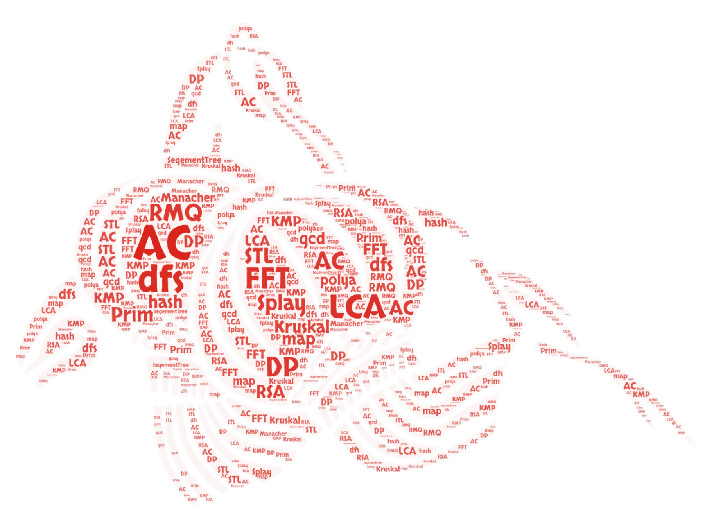

# 新年快乐！

## 网站建设
本网站仿照 [OI-Wiki](https://oi-wiki.org/) 基于 `mkdocs` 设计，用于学习算法竞赛相关的内容。支持 markdown 和 LaTeX 语法。
本项目托管在GitHub的 [repo](https://github.com/CUCCS/acm-wiki) 中，由Travis自动部署。

## 移动端
手机移动端目录树在左上角，也可在右下角翻页。

## 如何参与
如果您有意向参与贡献，请在仓库 `master` 分支 `/docs` 目录下添加 markdown文件，并在 `mkdocs.yml` 文件内容里增加相应的页面。然后 `pull request` 就可以了。

### 文档存储格式

- 文件名请务必都小写，以`-`分割，如`file-name`。
- 请务必确保您的文档中引用的**外链**图片已经全部转存到了**本库内**对应的`img`文件夹中，建议处理成`MD 文档名称 + 编号`的形式；（即格式为``）。

## 联系方式
QQ: 3208413453
Github: [LyuLumos](https://github.com/LyuLumos)