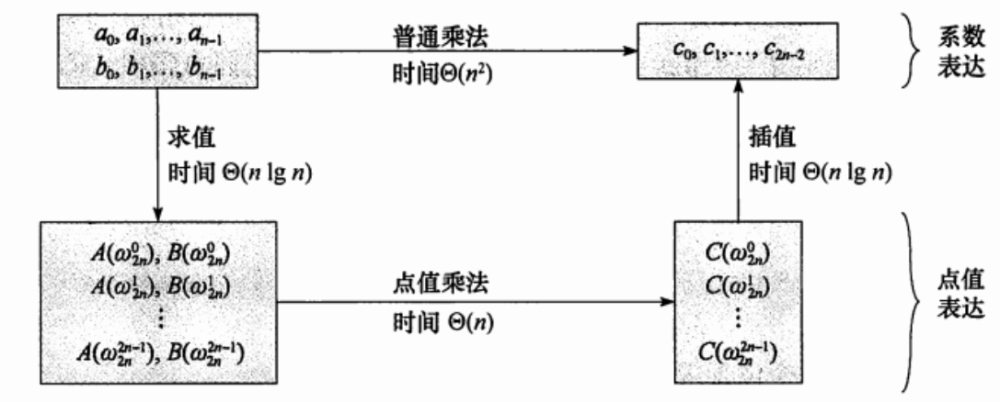
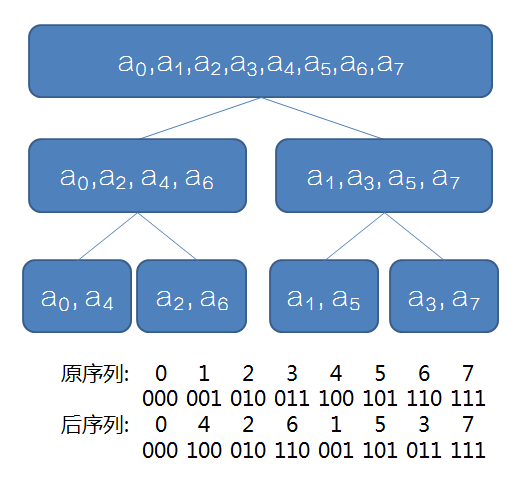

!!! note "Copyright"
    本页面贡献者：[LyuLumos](https://github.com/LyuLumos)。
    本页面内容遵循 MIT 协议，转载请附上原文出处链接和本声明。

## 概述
中文名：快速(离散)傅里叶变换

作用 : 以 $O(nlogn)$ 的复杂度计算多项式乘法


## 前置知识

### 多项式的系数表达和点值表达

系数表达：$F(x)=∑_{i=0}^{n}a_i x^i$，如 $F(x)=x^2+x+1$

点值表达：$X={x_0,x_1,...x_n}$ 代入多项式 $F(x)$ ，得到的 $n+1$个点分别为 $(x_0,y_0)(x_1,y_1)...(x_n,y_n)$


### 定理
>在平面直角坐标系中，$(n+1)$个点值对就能确定一个$n$次多项式的全部系数。

比如，只要知道两个点的坐标就可以通过待定系数法确定之前的方程。

当次数比较高的时候，可以通过拉格朗日插值法进行确定。

也就是说我们计算两个 $n$ 次多项式相乘只要取 $2n+1$个点进行分别计算就行了。

但是，如果随便取这些点，复杂度仍为 $O(n^2)$。


### 单位根
>在复平面上，以原点为圆心，1为半径作圆，所得的圆叫单位圆。以圆点为起点，圆的$n$等分点为终点，做$n$个向量，设幅角为正且最小的向量对应的复数为$ω_n$，称为$n$次单位根。 

在代数中，若$z^n=1$，我们把$z$称为$n$次单位根。


#### 性质
设$n$为2的整数次幂  


1. $\omega_{2n}^{2k} = \omega_{n}^{k}$&emsp; (对应的向量相同)
   
2. $\omega_{n}^{k + \frac{n}{2}} = -\omega_{n}^{k}$&emsp;（对应的向量等大反向）

借助图可以更好的理解。

## 快速傅里叶变换
时间复杂度 $O(nlog_2n)$

### 理论
设函数

$$FL(x)=f_0+f_2x+...+f_{n-2}x^{n/2-1}$$

$$FR(x)=f_1+f_3x+...+f_{n-1}x^{n/2-1}$$

则有 

$$F(x)=FL(x^2)+xFR(x^2)$$


代入$ω^k_n$、$ω_n^{k+n/2}$，经计算化简

$$F(ω^k_n)=FL(ω^k_{n/2})+ω^k_nFR(ω^k_{n/2})$$

$$F(ω_n^{k+n/2})=FL(ω_{n/2}^k)−ω_n^kFR(ω_{n/2}^k)$$  

如果我们知道两个多项式 $FL(x)$ 和 $FR(x)$分别在$ω^0_{n/2},ω^1_{n/2},ω^2_{n/2},...,ω^{n/2-1}_{n/2}$的点值表示，就可以$O(n)$求出 $F(x) 在 ω^0_{n},ω^1_{n},ω^2_{n},...,ω^{n-1}_{n}$处的点值表示。  
用分治法求下去。

把DFT中的 $ω^1_n$ 换成 $ω^{-1}_n$，做完之后除以 $n$ 即可实现IDFT。DFT/IDFT核心代码可以复用。


```cpp
void fft(CP *f, bool flag) { // flag=-1为IDFT
  for (int p = 2; p <= n; p <<= 1) {
    int len = p >> 1;
    CP tG(cos(2 * Pi / p), sin(2 * Pi / p));
    if (!flag) tG.y *= -1;
    for (int k = 0; k < n; k += p) {
      CP buf(1, 0);
      for (int l = k; l < k + len; l++) {
        CP tt = buf * f[len + l];
        f[len + l] = f[l] - tt; // (1)
        f[l] = f[l] + tt; // (2)
        buf = buf * tG; //得到下一个[反]单位根
      }
    }
  }
}
```


关于IFFT的证明有很多，相对来说也比较复杂，这里给出一种数学上的理解。

$$
\left(\begin{array}{ccccc}  x_{0}^{0} & x_{0}^{1} & x_{0}^{2} & \ldots & x_{0}^{n-1} \\  x_{1}^{0} & x_{1}^{1} & x_{1}^{2} & \ldots & x_{1}^{n-1} \\  \ldots & \ldots & \ldots & \ldots & \ldots \\  \ldots & \ldots & \ldots & \ldots & \ldots \\  x_{n-1}^{0} & x_{n-1}^{1} & x_{n-1}^{2} & \ldots & x_{n-1}^{n-1}  \end{array}\right)\left(\begin{array}{c}  a_{0} \\  a_{1} \\  \ldots \\  a_{n-1}  \end{array}\right)=\left(\begin{array}{c}  y_{0} \\  y_{1} \\  \ldots \\  \ldots \\  y_{n-1}  \end{array}\right) \\
$$

我们把上述矩阵抽象成 $WA=B$。

则 $A=W^{-1}B$


那么其实我们要做的就是范德蒙德矩阵求逆。

$$
W=\left(\begin{array}{ccccc}  (w_n^{0})^{0} & (w_n^{0})^{1} & (w_n^{0})^{2} & \ldots & (w_n^{0})^{n-1} \\  (w_n^{1})^{0} & (w_n^{1})^{1} & (w_n^{1})^{2} & \ldots & (w_n^{1})^{n-1} \\  \ldots & \ldots & \ldots & \ldots & \ldots \\  \ldots & \ldots & \ldots & \ldots & \ldots \\  (w_n^{n-1})^{0} & (w_n^{n-1})^{1} & (w_n^{n-1})^{2} & \ldots & (w_n^{n-1})^{n-1} \\  \end{array}\right)=  \left(\begin{array}{ccccc}  1 & 1 & 1 & \ldots & 1 \\  1 & w_n^{1\times 1} & w_n^{1\times 2} & \ldots & w_n^{1\times (n-1)} \\  \ldots & \ldots & \ldots & \ldots & \ldots \\  \ldots & \ldots & \ldots & \ldots & \ldots \\  1 & w_n^{(n-1)\times 1} & w_n^{(n-1)\times 2} & \ldots & w_n^{(n-1)\times (n-1)} \\  \end{array}\right) \\
$$


$$
  W^{-1}=\frac{1}{n}\left(\begin{array}{ccccc}  1 & 1 & 1 & \ldots & 1 \\  1 & w_n^{-1\times 1} & w_n^{-1\times 2} & \ldots & w_n^{-1\times (n-1)} \\  \ldots & \ldots & \ldots & \ldots & \ldots \\  \ldots & \ldots & \ldots & \ldots & \ldots \\  1 & w_n^{-(n-1)\times 1} & w_n^{-(n-1)\times 2} & \ldots & w_n^{-(n-1)\times (n-1)} \\  \end{array}\right)   \\
$$

观察发现，只需要变换指数的正负，再乘 $\frac{1}{n}$，IFFT和FFT的流程就完全一致了。


## 点值表示和系数表示之间的转换




### 优化：蝴蝶变换

要求的序列实际是原序列下标的二进制反转。




### 优化：三次变两次 
根据 $(a+bi)(c+di)==ac−bd+adi+bci$

要求 $F(x)G(x)$，设复多项式 $P(x)=F(x)+G(x)i$,

则 $P(x)^2==F(x)^2-G(x)^2+2F(x)G(x)i$

发现$P(x)^2$的虚部为 $2F(x)G(x)$  

也就是说求出 $P(x)^2$之后,把它的虚部除以2即可。


```cpp
#include <algorithm>
#include <cmath>
#include <cstdio>
#define Maxn 1350000
using namespace std;
const double Pi = acos(-1);
inline int read() {
  register char ch = 0;
  while (ch < 48 || ch > 57) ch = getchar();
  return ch - '0';
}
int n, m;
struct CP {
  CP(double xx = 0, double yy = 0) { x = xx, y = yy; }
  double x, y;
  CP operator+(CP const &B) const { return CP(x + B.x, y + B.y); }
  CP operator-(CP const &B) const { return CP(x - B.x, y - B.y); }
  CP operator*(CP const &B) const {
    return CP(x * B.x - y * B.y, x * B.y + y * B.x);
  }
} f[Maxn << 1];  //只用了一个复数数组
int tr[Maxn << 1];
void fft(CP *f, bool flag) {
  for (int i = 0; i < n; i++)
    if (i < tr[i]) swap(f[i], f[tr[i]]);
  for (int p = 2; p <= n; p <<= 1) {
    int len = p >> 1;
    CP tG(cos(2 * Pi / p), sin(2 * Pi / p));
    if (!flag) tG.y *= -1;
    for (int k = 0; k < n; k += p) {
      CP buf(1, 0);
      for (int l = k; l < k + len; l++) {
        CP tt = buf * f[len + l];
        f[len + l] = f[l] - tt;
        f[l] = f[l] + tt;
        buf = buf * tG;
      }
    }
  }
}
int main() {
  scanf("%d%d", &n, &m);
  for (int i = 0; i <= n; i++) f[i].x = read();
  for (int i = 0; i <= m; i++) f[i].y = read();
  for (m += n, n = 1; n <= m; n <<= 1);
  for (int i = 0; i < n; i++)
    tr[i] = (tr[i >> 1] >> 1) | ((i & 1) ? n >> 1 : 0);
  fft(f, 1);
  for (int i = 0; i < n; ++i) f[i] = f[i] * f[i];
  fft(f, 0);
  for (int i = 0; i <= m; ++i) printf("%d ", (int)(f[i].y / n / 2 + 0.49));
  return 0;
}
```


## 其他
尽管FFT优于朴素算法，但是由于常数过大（复数背后是浮点数运算），同时还有精度的限制，所以数论中仍有其他的算法如NTT（快速数论变换），供大家后续学习。


## 例题
[洛谷P3803 多项式乘法](https://www.luogu.com.cn/problem/P3803)

## 参考资料  
[FFT学习笔记](https://www.luogu.com.cn/blog/command-block/fft-xue-xi-bi-ji)  
[快速傅里叶变换详解](https://www.cnblogs.com/zwfymqz/p/8244902.html)